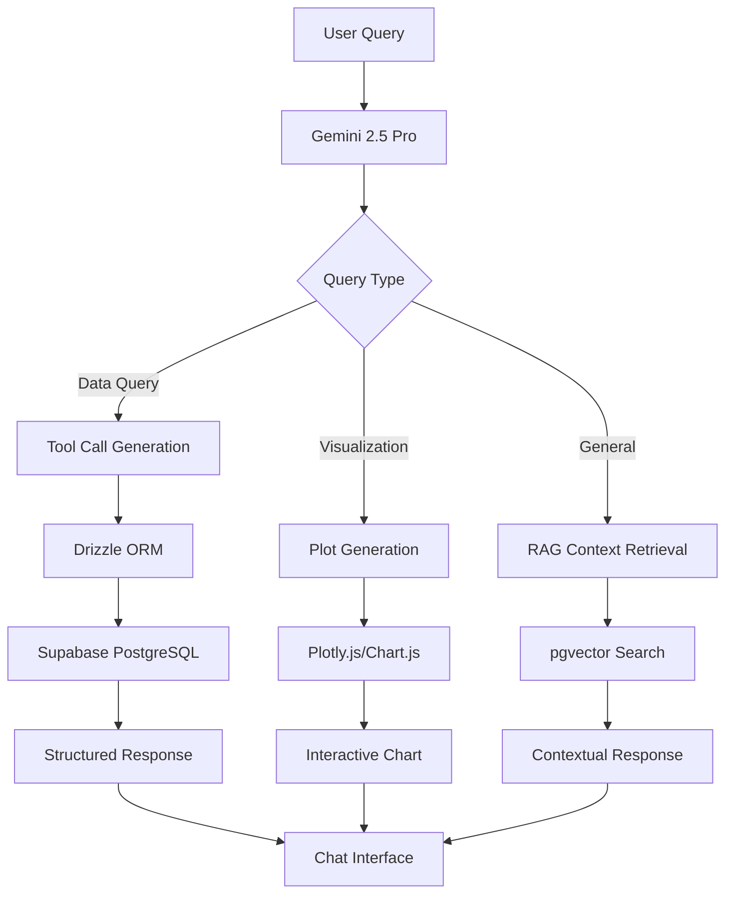
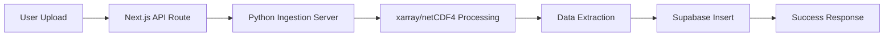

# FloatChat Multimodal Conversational Chatbot Implementation Guide

## 🤖 AI-Powered Ocean Data Intelligence

Advanced multimodal conversational chatbot that interprets natural language queries about oceanographic data, performs intelligent tool calls to retrieve ARGO float information, and generates interactive visualizations with reporting capabilities.

---

## 🔑 Tech Stack

- **Frontend**: Next.js + React (TypeScript)
- **AI Framework**: Vercel AI SDK with tool calling capabilities
- **LLM Provider**: Google Gemini 2.5 Pro
- **Authentication**: Clerk (simple and secure)
- **Primary Database**: Convex (chats, users, sessions)
- **Ocean Data Storage**: Supabase PostgreSQL + pgvector
- **ORM Layer**: Drizzle ORM (for Supabase tool calls)
- **Visualization**: Plotly.js, Chart.js, and D3.js
- **Data Processing**: Python ingestion server (Railway/Render)
- **File Storage**: Cloudinary (for PDF reports and uploads)
- **RAG Implementation**: Supabase pgvector + Vercel AI SDK RAG

---

## 🚀 Features Implementation

### **Core MVP Features**

- [x] Planning & Architecture Design
- [ ] Multimodal chat interface with streaming responses
- [ ] Natural language to SQL query generation
- [ ] Interactive data visualizations in chat
- [ ] NetCDF file upload and processing
- [ ] User authentication with Clerk

### **Judge-Wow Features**

- [ ] Real-time plot generation from queries
- [ ] Smart context-aware responses
- [ ] Conversation export to PDF reports
- [ ] RAG-enhanced responses with research context
- [ ] Tool calling with schema-aware LLM

### **Stretch Features**

- [ ] Multi-float comparison visualizations
- [ ] Conversational data exploration workflows
- [ ] Advanced filtering and aggregation queries
- [ ] Collaborative chat sessions

---

## 🏗️ Architecture Overview

### **Data Flow Pipeline**



### **Database Architecture**

```typescript
// Convex (Primary Database)
interface ChatSession {
  id: string;
  userId: string;
  title: string;
  messages: Message[];
  createdAt: Date;
  updatedAt: Date;
}

// Supabase (Ocean Data + RAG)
interface ArgoFloat {
  id: string;
  latitude: number;
  longitude: number;
  depth: number;
  temperature: number;
  salinity: number;
  date: Date;
  region: string;
}

interface VectorEmbedding {
  id: string;
  content: string;
  embedding: number[];
  metadata: object;
}
```

---

## 🏗️ Project Structure

```
src/app/
├── chat/
│   ├── page.tsx              # Main chat interface
│   └── components/
│       ├── ChatInterface.tsx # Chat UI with streaming
│       ├── MessageBubble.tsx # Individual message rendering
│       ├── PlotRenderer.tsx  # Inline plot display
│       └── ToolCallCard.tsx  # Tool execution display
├── upload/
│   ├── page.tsx              # NetCDF upload interface
│   └── components/
│       ├── FileUpload.tsx    # Drag & drop upload
│       └── ProcessingStatus.tsx # Upload progress
└── api/
    ├── chat/
    │   └── route.ts          # Chat API with tool calling
    ├── ingestion/
    │   └── route.ts          # NetCDF processing proxy
    └── embeddings/
        └── route.ts          # RAG vector operations

src/lib/
├── ai-config.ts             # Gemini AI SDK configuration
├── tools/
│   ├── ocean-data-tools.ts  # Database query tools
│   ├── visualization-tools.ts # Plot generation tools
│   └── rag-tools.ts         # Context retrieval tools
├── database/
│   ├── convex-client.ts     # Convex connection
│   ├── supabase-client.ts   # Supabase connection
│   └── drizzle-schema.ts    # Database schema
└── utils/
    ├── query-parser.ts      # Natural language parsing
    ├── plot-generator.ts    # Chart configuration
    └── pdf-export.ts        # Report generation

external/
└── ingestion-server/        # Python server (separate deployment)
    ├── app.py              # FastAPI server
    ├── netcdf_processor.py # NetCDF data extraction
    └── requirements.txt    # Python dependencies
```

---

## ⚙️ Setup Instructions

### **1. Authentication Setup (Clerk)**

1. **Create Clerk Account**:

   - Visit [clerk.com](https://clerk.com)
   - Create new application
   - Copy API keys from dashboard

2. **Environment Variables**:
   ```bash
   # .env.local
   NEXT_PUBLIC_CLERK_PUBLISHABLE_KEY=pk_test_...
   CLERK_SECRET_KEY=sk_test_...
   NEXT_PUBLIC_CLERK_SIGN_IN_URL=/sign-in
   NEXT_PUBLIC_CLERK_SIGN_UP_URL=/sign-up
   ```

### **2. AI Configuration (Gemini 2.5 Pro)**

```bash
# .env.local
GOOGLE_GENERATIVE_AI_API_KEY=your_gemini_api_key_here

# AI SDK Configuration
NEXT_PUBLIC_AI_MODEL=gemini-2.5-pro
```

### **3. Database Setup**

#### **Convex (Primary Database)**

```bash
# Install Convex CLI
npm install -g convex

# Initialize Convex
npx convex dev

# Add environment variables
CONVEX_DEPLOYMENT=your_deployment_name
NEXT_PUBLIC_CONVEX_URL=https://your_deployment.convex.cloud
```

#### **Supabase (Ocean Data & RAG)**

```bash
# .env.local
SUPABASE_URL=https://your_project.supabase.co
SUPABASE_ANON_KEY=your_anon_key
SUPABASE_SERVICE_ROLE_KEY=your_service_role_key

# Enable pgvector extension in Supabase
# SQL Editor: CREATE EXTENSION IF NOT EXISTS vector;
```

### **4. Dependencies Installation**

```bash
# Core dependencies
npm install @ai-sdk/google
npm install ai
npm install @clerk/nextjs
npm install convex
npm install @supabase/supabase-js
npm install drizzle-orm
npm install @neondatabase/serverless

# Visualization libraries
npm install plotly.js
npm install chart.js
npm install d3

# File handling
npm install cloudinary
npm install multer
npm install @types/multer

# PDF generation
npm install jspdf
npm install html2canvas
```

---

## 🛠️ Tool Implementation

### **Ocean Data Query Tool**

```typescript
// src/lib/tools/ocean-data-tools.ts
import { tool } from "ai";
import { z } from "zod";

export const queryFloatData = tool({
  description: "Query ARGO float data by location, time, or parameters",
  parameters: z.object({
    latitude: z.number().optional(),
    longitude: z.number().optional(),
    startDate: z.string().optional(),
    endDate: z.string().optional(),
    parameter: z.enum(["temperature", "salinity", "depth"]).optional(),
    region: z.string().optional(),
  }),
  execute: async (params) => {
    // Drizzle ORM query to Supabase
    const data = await db
      .select()
      .from(argoFloats)
      .where(/* build dynamic filters */);

    return {
      success: true,
      data,
      count: data.length,
      summary: `Found ${data.length} float measurements`,
    };
  },
});
```

### **Visualization Generation Tool**

```typescript
// src/lib/tools/visualization-tools.ts
export const generatePlot = tool({
  description: "Create interactive plots from ocean data",
  parameters: z.object({
    plotType: z.enum(["line", "scatter", "heatmap", "depth_profile"]),
    xAxis: z.string(),
    yAxis: z.string(),
    data: z.array(
      z.object({
        x: z.number(),
        y: z.number(),
        metadata: z.object({}).optional(),
      })
    ),
    title: z.string(),
  }),
  execute: async (params) => {
    const plotConfig = {
      data: [
        {
          x: params.data.map((d) => d.x),
          y: params.data.map((d) => d.y),
          type: params.plotType,
          mode: "lines+markers",
        },
      ],
      layout: {
        title: params.title,
        xaxis: { title: params.xAxis },
        yaxis: { title: params.yAxis },
      },
    };

    return {
      success: true,
      plotConfig,
      type: "plotly",
    };
  },
});
```

### **RAG Context Retrieval Tool**

```typescript
// src/lib/tools/rag-tools.ts
export const retrieveContext = tool({
  description: "Retrieve relevant research context for ocean queries",
  parameters: z.object({
    query: z.string(),
    limit: z.number().default(5),
  }),
  execute: async (params) => {
    // Generate query embedding
    const embedding = await generateEmbedding(params.query);

    // Vector similarity search
    const { data } = await supabase.rpc("match_documents", {
      query_embedding: embedding,
      match_threshold: 0.78,
      match_count: params.limit,
    });

    return {
      success: true,
      contexts: data,
      relevantDocs: data.length,
    };
  },
});
```

---

## 📊 Data Ingestion Pipeline

### **NetCDF Processing Flow**



### **Ingestion Server (Python)**

```python
# external/ingestion-server/app.py
from fastapi import FastAPI, UploadFile
import xarray as xr
import numpy as np

app = FastAPI()

@app.post("/process-netcdf")
async def process_netcdf(file: UploadFile):
    # Read NetCDF file
    dataset = xr.open_dataset(file.file)

    # Extract variables
    extracted_data = []
    for i in range(len(dataset.latitude)):
        extracted_data.append({
            'latitude': float(dataset.latitude[i]),
            'longitude': float(dataset.longitude[i]),
            'depth': float(dataset.depth[i]),
            'temperature': float(dataset.temperature[i]),
            'salinity': float(dataset.salinity[i]),
            'date': str(dataset.time[i].values),
            'region': determine_region(lat, lon),
        })

    # Send to Supabase via API
    result = await store_in_database(extracted_data)

    return {
        "success": True,
        "processed_records": len(extracted_data),
        "message": "NetCDF data successfully processed"
    }
```

---

## 🎨 Chat Interface Design

### **Message Types**

```typescript
interface Message {
  id: string;
  role: "user" | "assistant";
  content: string;
  timestamp: Date;
  toolCalls?: ToolCall[];
  visualizations?: PlotConfig[];
  metadata?: {
    queryType: "data" | "visualization" | "general";
    processingTime: number;
  };
}
```

### **Streaming Implementation**

```typescript
// src/app/api/chat/route.ts
import { streamText, tool } from "ai";
import { google } from "@ai-sdk/google";

export async function POST(req: Request) {
  const { messages } = await req.json();

  const result = streamText({
    model: google("gemini-2.5-pro"),
    messages,
    tools: {
      queryFloatData,
      generatePlot,
      retrieveContext,
    },
    system: `You are an expert oceanographer and data scientist...`,
  });

  return result.toDataStreamResponse();
}
```

---

## 🎯 Implementation Phases

### **Phase 1: Chat UI Foundation (6-8 hours)**

**Priority**: Core chat interface and design system

1. ✅ Architecture planning & tool design
2. ⏳ Next.js project setup with TypeScript
3. ⏳ Tailwind CSS + shadcn/ui component library setup
4. ⏳ Chat page layout (`/chat`) with responsive design
5. ⏳ Message bubble components (user/assistant styling)
6. ⏳ Input field with send button and auto-resize
7. ⏳ Markdown rendering for assistant responses
8. ⏳ Typing indicators and loading states
9. ⏳ Message timestamps and status indicators

**Deliverable**: Fully functional chat UI that looks professional

### **Phase 2: Basic AI Integration (4-6 hours)**

**Priority**: Get LLM responding without tools

1. ⏳ Vercel AI SDK installation and configuration
2. ⏳ Gemini 2.5 Pro API setup and environment variables
3. ⏳ Basic chat API route (`/api/chat`) with streaming
4. ⏳ `useChat` hook integration for real-time responses
5. ⏳ Error handling for API failures
6. ⏳ Simple system prompt for ocean data context
7. ⏳ Message history persistence in local state

**Deliverable**: Working chatbot that can have basic conversations

### **Phase 3: Authentication & User Management (3-4 hours)**

**Priority**: User sessions and data persistence

1. ⏳ Clerk authentication setup and configuration
2. ⏳ Sign-in/Sign-up pages with custom styling
3. ⏳ Protected routes middleware setup
4. ⏳ User profile integration in chat interface
5. ⏳ Basic session management and user context

**Deliverable**: Authenticated chat experience with user sessions

### **Phase 4: Database & Chat Persistence (4-5 hours)**

**Priority**: Save and retrieve chat history

1. ⏳ Convex database setup and initialization
2. ⏳ Chat schema design (sessions, messages, users)
3. ⏳ Database mutations for saving messages
4. ⏳ Chat history retrieval and display
5. ⏳ Multiple conversation support
6. ⏳ Conversation sidebar with session list
7. ⏳ New chat and conversation management

**Deliverable**: Persistent chat history across sessions

### **Phase 5: Tool Calling Foundation (5-6 hours)**

**Priority**: Basic data query capabilities

1. ⏳ Supabase PostgreSQL setup and configuration
2. ⏳ Drizzle ORM installation and schema design
3. ⏳ Mock ARGO float data insertion (sample dataset)
4. ⏳ Simple query tool implementation
5. ⏳ Tool call UI components (loading, results display)
6. ⏳ Basic natural language to SQL conversion
7. ⏳ Error handling for failed tool calls

**Deliverable**: Chatbot can answer simple data queries with real responses

### **Phase 6: Data Visualization (4-5 hours)**

**Priority**: Generate and display charts in chat

1. ⏳ Plotly.js installation and configuration
2. ⏳ Chart generation tool implementation
3. ⏳ Plot rendering component in chat interface
4. ⏳ Multiple chart types (line, scatter, bar)
5. ⏳ Interactive chart controls and zoom
6. ⏳ Chart export functionality
7. ⏳ Responsive chart sizing for mobile

**Deliverable**: Chatbot generates interactive visualizations from queries

### **Phase 7: File Upload & Processing (5-6 hours)**

**Priority**: NetCDF data ingestion

1. ⏳ Upload page UI (`/upload`) with drag & drop
2. ⏳ File validation (NetCDF format checking)
3. ⏳ Python ingestion server development
4. ⏳ Railway/Render deployment for Python server
5. ⏳ Next.js API proxy for file processing
6. ⏳ Upload progress indicators and status updates
7. ⏳ Integration with chat (reference uploaded data)

**Deliverable**: Users can upload NetCDF files and chat about the data

### **Phase 8: RAG Implementation (4-5 hours)**

**Priority**: Research context integration

1. ⏳ pgvector extension setup in Supabase
2. ⏳ Embedding generation and storage
3. ⏳ Context retrieval tool implementation
4. ⏳ RAG-enhanced response generation
5. ⏳ Source citation in chat responses
6. ⏳ Context relevance scoring and filtering

**Deliverable**: Chatbot provides research-backed answers with citations

### **Phase 9: Advanced Features (6-7 hours)**

**Priority**: Polish and professional features

1. ⏳ PDF report generation from conversations
2. ⏳ Conversation export and sharing
3. ⏳ Advanced visualization types (heatmaps, 3D plots)
4. ⏳ Conversation search and filtering
5. ⏳ Performance optimization and caching
6. ⏳ Error boundary implementation
7. ⏳ Mobile responsiveness refinement

**Deliverable**: Production-ready chatbot with advanced capabilities

### **Phase 10: Demo Preparation (2-3 hours)**

**Priority**: Final polish for presentation

1. ⏳ Demo data preparation and seeding
2. ⏳ Performance testing and optimization
3. ⏳ Demo script practice and timing
4. ⏳ Fallback preparations and error handling
5. ⏳ Final UI polish and animations
6. ⏳ Documentation and setup verification

**Deliverable**: Demo-ready application with prepared presentation

---

## 🧪 Testing Strategy

### **Query Testing Scenarios**

```typescript
// Test queries for demo
const testQueries = [
  "Show me temperature data near 10°N, 75°E in March 2023",
  "Create a depth vs temperature plot for the Arabian Sea",
  "What's the average salinity in the Bay of Bengal?",
  "Compare temperature trends between two float locations",
  "Generate a report of today's conversation with all plots",
];
```

### **Tool Call Validation**

- [ ] Natural language correctly parsed to tool parameters
- [ ] Database queries return accurate results
- [ ] Plots render correctly with proper data
- [ ] RAG context retrieval provides relevant information
- [ ] PDF export includes all conversation elements

---

## 🚀 Performance Optimization

### **Streaming Strategy**

- Real-time response streaming via Vercel AI SDK
- Progressive tool call execution display
- Lazy loading for large visualizations
- Debounced user input handling

### **Database Optimization**

- Indexed queries on latitude, longitude, date
- Connection pooling for Supabase
- Cached embeddings for frequently asked queries
- Optimized vector similarity search

---

## 🎪 Judge Demo Script

### **Opening (30 seconds)**

"Meet FloatChat - an AI oceanographer that speaks your language. Watch as we explore ocean data through natural conversation..."

### **Key Demo Points**

1. **Natural Queries**: "Ask complex questions in plain English"
2. **Intelligent Tool Calls**: "AI automatically queries the right data"
3. **Live Visualizations**: "Instant interactive plots in the chat"
4. **Context Awareness**: "RAG provides research-backed insights"
5. **Report Generation**: "Export complete analysis as PDF"

### **Demo Flow**

1. Simple query: "What's the temperature near Mumbai coast?"
2. Visualization: "Show me a depth profile for this location"
3. Comparison: "How does this compare to last year?"
4. RAG query: "What do research papers say about this pattern?"
5. Export: "Generate a summary report of our analysis"

---

## 🔧 Troubleshooting

### **Common Issues**

1. **Tool Call Failures**: Check Drizzle schema and Supabase connection
2. **Slow Responses**: Optimize database queries and add indexes
3. **Plot Rendering**: Verify Plotly.js configuration and data format
4. **Authentication**: Ensure Clerk middleware is properly configured
5. **File Uploads**: Check file size limits and CORS settings

### **Fallback Strategies**

- Mock data responses if database is unavailable
- Static images if plot rendering fails
- Simplified UI for mobile browsers
- Pre-recorded demo video as backup

---

## 📋 Environment Variables Reference

```bash
# Authentication
NEXT_PUBLIC_CLERK_PUBLISHABLE_KEY=pk_test_...
CLERK_SECRET_KEY=sk_test_...

# AI Configuration
GOOGLE_GENERATIVE_AI_API_KEY=your_gemini_key

# Databases
CONVEX_DEPLOYMENT=your_deployment
NEXT_PUBLIC_CONVEX_URL=https://your_deployment.convex.cloud
SUPABASE_URL=https://your_project.supabase.co
SUPABASE_ANON_KEY=your_anon_key

# External Services
CLOUDINARY_CLOUD_NAME=your_cloud_name
CLOUDINARY_API_KEY=your_api_key
PYTHON_INGESTION_SERVER_URL=https://your_server.railway.app
```

---

## 📋 Next Steps

After chatbot completion:

1. **Dashboard Integration**: Context sharing between chat and map
2. **Advanced RAG**: Multi-modal document ingestion
3. **Collaborative Features**: Shared chat sessions
4. **Real-time Updates**: Live data streaming from ARGO network
5. **Mobile App**: React Native implementation

---

_Chatbot Implementation Status: Ready to Build_ 🤖✨
